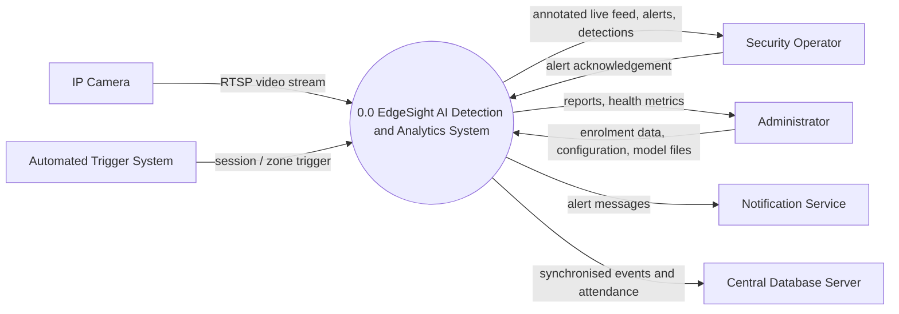
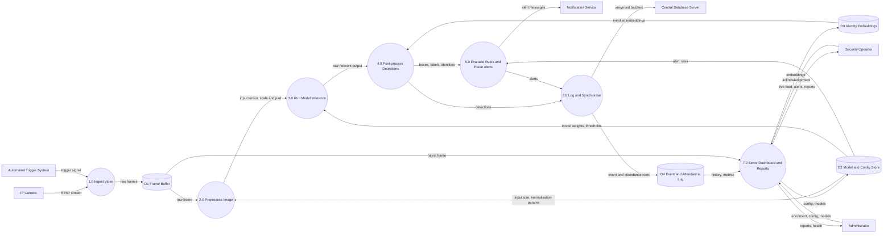
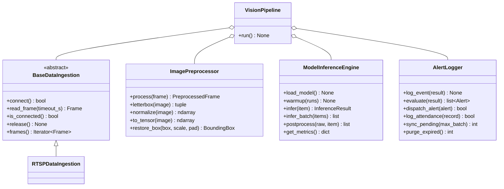

# ARCHITECTURE.md — System Design Specification

**Project:** EdgeSight — AI Object Detection, Attendance & Surveillance Analytics
**Course:** Lab 02 — System Requirements & Software Architecture for AI Projects
**Author:** Muhammad Mansoor Ul Haq
**Version:** 1.0

---

## Table of Contents

1. [Introduction](#1-introduction)
2. [Functional & Non-Functional Requirements](#2-functional--non-functional-requirements)
3. [System Boundary, Actors & I/O Specification](#3-system-boundary-actors--io-specification)
4. [Data-Flow Diagrams](#4-data-flow-diagrams)
5. [Modular Software Architecture](#5-modular-software-architecture)
6. [Traceability Matrix](#6-traceability-matrix)
7. [Repository Layout](#7-repository-layout)

---

## 1. Introduction

### 1.1 Purpose
This document specifies the requirements and software architecture of **EdgeSight**, an edge-deployed computer-vision system. A single detection pipeline serves two application profiles:

| Profile | Description |
|---|---|
| **Smart Attendance** | Detects and recognises enrolled faces at a classroom entrance and logs attendance automatically. |
| **AI Surveillance** | Detects people/objects in monitored zones and raises real-time alerts to security operators. |

### 1.2 Scope
EdgeSight ingests live camera streams, runs object/face detection on an edge device (NVIDIA Jetson-class), stores events locally, and synchronises them with a central server. Camera hardware, the enterprise network and the third-party notification gateways are **outside** the system boundary.

### 1.3 Definitions

| Term | Meaning |
|---|---|
| RTSP | Real Time Streaming Protocol (camera transport) |
| NMS | Non-Maximum Suppression |
| TAR / FAR | True Accept Rate / False Accept Rate |
| DFD | Data-Flow Diagram |
| Edge device | On-premise inference hardware (e.g. Jetson Orin Nano, 8 GB) |

---

## 2. Functional & Non-Functional Requirements

### 2.1 Functional Requirements (Smart Attendance System)

| ID | Requirement | Acceptance Criterion | Priority |
|---|---|---|---|
| **FR-01** | **Face detection latency.** The system shall detect all faces in each processed frame. | End-to-end detection latency ≤ **100 ms** per frame (p95) on the edge device. | Must |
| **FR-02** | **Face recognition.** The system shall match each detected face against enrolled identity embeddings and return the identity with a confidence score. | Cosine-similarity match threshold ≥ 0.6; unknown faces labelled `UNKNOWN`. | Must |
| **FR-03** | **Attendance logging.** The system shall record `person_id`, `camera_id`, timestamp and confidence once per person per class session. | Duplicate detections within one session create **0** additional records. | Must |
| **FR-04** | **Database synchronisation.** The system shall queue records locally and synchronise them to the central database, resuming automatically after connectivity loss. | Zero record loss across a 1-hour network outage; sync completes ≤ 60 s after reconnect. | Must |
| **FR-05** | **Enrolment & reporting.** An administrator shall be able to enrol/remove students and export attendance reports (CSV/PDF) by date, course, or student. | Report generated ≤ 5 s for 1 semester of data (≈ 50 000 rows). | Should |

### 2.2 Non-Functional Requirements

| ID | Category | Requirement | Measurable Target | Verification |
|---|---|---|---|---|
| **NFR-01** | Performance | Minimum sustained processing frame rate per camera. | ≥ **15 FPS** at 1080p input | Benchmark over 10-min stream |
| **NFR-02** | Accuracy | Face recognition accuracy on the enrolment test set. | TAR ≥ **95 %** at FAR ≤ 0.1 %; detector mAP@0.5 ≥ **0.85** | Held-out validation set |
| **NFR-03** | Power / Resources | Edge device power and memory budget. | ≤ **15 W** average; ≤ **4 GB** RAM/GPU memory footprint | `tegrastats` profiling |
| **NFR-04** | Privacy & Security | Biometric data protection. | Embeddings encrypted at rest (AES-256); TLS 1.3 in transit; raw frames not persisted beyond **24 h**; role-based access; consent recorded at enrolment | Security review & audit log |
| **NFR-05** | Reliability | Availability and fault recovery. | ≥ **99 %** uptime during operating hours; automatic stream reconnect ≤ **30 s** | Soak test (72 h) |

---

## 3. System Boundary, Actors & I/O Specification

### 3.1 Primary Actors

| Actor | Type | Role | Interactions |
|---|---|---|---|
| **Security Operator** | Human | Monitors live feed and responds to alerts. | Views dashboard, acknowledges/dismisses alerts, reviews snapshots. |
| **Administrator** | Human | Configures and maintains the system. | Enrols identities, edits rules/thresholds, manages cameras, exports reports. |
| **Instructor / Faculty** | Human | Consumes attendance data. | Views and exports course attendance. |
| **IP Camera** | External device | Video source. | Streams RTSP/H.264 to the system. |
| **Automated Trigger System** | External system | Event source (e.g. door sensor, class schedule). | Starts/stops attendance sessions, arms/disarms zones. |
| **Notification Service** | External system | Alert delivery. | Receives alerts via SMTP / SMS / webhook. |
| **Central Database Server** | External system | Long-term storage. | Receives synchronised events. |

### 3.2 System Inputs

| ID | Input | Source | Format / Parameters |
|---|---|---|---|
| **IN-01** | Video stream | IP Camera | RTSP, H.264/H.265, 1920×1080 @ 25–30 FPS, 2–4 Mbps per camera |
| **IN-02** | Sensor / trigger signal | Automated Trigger System | JSON over MQTT/HTTP: `{event, zone_id, timestamp}` |
| **IN-03** | Enrolment data | Administrator | ≥ 5 face images per person (JPEG/PNG, ≥ 200×200 px) + metadata |
| **IN-04** | Configuration | Administrator | YAML/JSON: confidence threshold (default 0.5), NMS IoU (0.45), alert rules, retention days |
| **IN-05** | Model artefacts | Model registry | ONNX / TensorRT engine file (FP16), label map |
| **IN-06** | Alert acknowledgement | Security Operator | REST call `{alert_id, action, note}` |

### 3.3 System Outputs

| ID | Output | Destination | Format / Content |
|---|---|---|---|
| **OUT-01** | Detections | Internal / Dashboard | Per frame: `label`, `confidence`, bounding box `[x_min, y_min, x_max, y_max]` in pixels, optional `identity` |
| **OUT-02** | Alert notifications | Operator, Notification Service | Rule name, severity, camera, timestamp, snapshot URL |
| **OUT-03** | Attendance records | Local DB → Central DB | `person_id, camera_id, timestamp, confidence, session_id` |
| **OUT-04** | Event log entries | Local DB | Structured JSON log of each inference result and system event |
| **OUT-05** | Annotated live feed | Dashboard | MJPEG/WebRTC stream with boxes overlaid |
| **OUT-06** | Reports | Administrator / Instructor | CSV / PDF |
| **OUT-07** | Health metrics | Admin dashboard | FPS, latency, GPU load, temperature, dropped frames |

### 3.4 Operational Constraints

| ID | Constraint | Limit |
|---|---|---|
| **OC-01** | Maximum memory footprint (edge device) | 4 GB combined RAM + GPU memory |
| **OC-02** | Network bandwidth | ≤ 4 Mbps per camera inbound; ≤ 1 Mbps uplink to central server (events and snapshots only, **no raw video upload**) |
| **OC-03** | Cameras per edge node | Up to 4 concurrent streams |
| **OC-04** | Power envelope | 15 W (Jetson Orin Nano 15 W mode) |
| **OC-05** | Local storage | 64 GB; 30-day event retention, 24-hour raw-frame retention |
| **OC-06** | Offline operation | Full detection and logging must work without internet |
| **OC-07** | Software stack | Python 3.10+, ONNX Runtime / TensorRT, OpenCV, SQLite (edge) → PostgreSQL (central) |
| **OC-08** | Regulatory | Must comply with institutional biometric-consent policy and applicable data-protection law |

### 3.5 Boundary Summary

| Inside the Boundary | Outside the Boundary |
|---|---|
| Frame ingestion, preprocessing, inference, post-processing | Camera hardware and optics |
| Rule engine, alert generation, event/attendance logging | SMS/email gateways |
| Local database and sync agent | Central database server internals |
| Operator/Admin dashboard API | Campus network infrastructure |

---

## 4. Data-Flow Diagrams

> Diagrams are written in Mermaid and render natively on GitHub. Notation: **rectangle** = external entity, **circle / rounded node** = process, **cylinder** = data store, **labelled arrow** = data flow.

### 4.1 Level 0 — Context Diagram



### 4.2 Level 1 — Detection Pipeline



### 4.3 Process Descriptions

| Process | Inputs | Outputs | Implemented By |
|---|---|---|---|
| 1.0 Ingest Video | RTSP stream, trigger | Raw `Frame` | `DataIngestion` |
| 2.0 Preprocess Image | `Frame`, config | `PreprocessedFrame` | `ImagePreprocessor` |
| 3.0 Run Model Inference | Tensor, weights | Raw network output | `ModelInferenceEngine.infer` |
| 4.0 Post-process Detections | Raw output, embeddings | `InferenceResult` (confidence filter, NMS, coordinate restore, identity match) | `ModelInferenceEngine.postprocess` |
| 5.0 Evaluate Rules | `InferenceResult`, rules | `Alert` list | `AlertLogger.evaluate` |
| 6.0 Log and Synchronise | Results, alerts | DB rows, synced batches | `AlertLogger` |
| 7.0 Serve Dashboard | DB, frames, admin input | Feed, reports | Dashboard/API service (out of Lab 02 code scope) |

---

## 5. Modular Software Architecture

### 5.1 Module Responsibilities

| Module | Responsibility | Input | Output | Depends On |
|---|---|---|---|---|
| **DataIngestion** | Open camera/file source, decode, drop stale frames, auto-reconnect. | RTSP URL / file path | `Frame` | OpenCV / FFmpeg |
| **ImagePreprocessor** | Letterbox resize, BGR→RGB, normalise, build NCHW tensor, keep scale/pad for box restoration. | `Frame` | `PreprocessedFrame` | NumPy, OpenCV |
| **ModelInferenceEngine** | Load model, warm up, run inference, confidence filter, NMS, restore coordinates, report latency. | `PreprocessedFrame` | `InferenceResult` | ONNX Runtime / TensorRT |
| **AlertLogger** | Persist events, evaluate rules with cooldown, dispatch alerts, log attendance once per session, sync to central DB, enforce retention. | `InferenceResult` | `Alert`, DB rows | SQLite, HTTP client |
| **VisionPipeline** (orchestrator) | Wire modules and run the main loop. | All of the above | — | All modules |

### 5.2 Class Diagram



### 5.3 Interface Source Files (`src/cv_pipeline/`)

All files below are checked into the repository as skeleton `.py` interfaces. Bodies raise `NotImplementedError` and are to be implemented in later labs.

#### 5.3.1 `schemas.py` — shared data contracts
```python
"""Shared data contracts passed between pipeline modules."""
from __future__ import annotations

from dataclasses import dataclass, field
from enum import Enum
from typing import Dict, List, Optional, Tuple

import numpy as np


class Severity(str, Enum):
    INFO = "INFO"
    WARNING = "WARNING"
    CRITICAL = "CRITICAL"


@dataclass(frozen=True)
class Frame:
    """Raw frame produced by DataIngestion."""
    frame_id: int
    camera_id: str
    timestamp_utc: float              # UNIX epoch seconds
    image: np.ndarray                 # HxWx3, uint8, BGR
    source_resolution: Tuple[int, int]  # (width, height)


@dataclass(frozen=True)
class PreprocessedFrame:
    """Model-ready tensor plus metadata needed to map boxes back."""
    frame: Frame
    tensor: np.ndarray                # 1x3xHxW, float32, normalised
    scale: float                      # resize ratio applied
    pad: Tuple[int, int]              # (pad_x, pad_y) from letterboxing


@dataclass(frozen=True)
class BoundingBox:
    x_min: float
    y_min: float
    x_max: float
    y_max: float                      # pixel coords in ORIGINAL frame space


@dataclass(frozen=True)
class Detection:
    label: str
    confidence: float                 # 0.0 - 1.0
    box: BoundingBox
    identity: Optional[str] = None    # filled when face recognition matches


@dataclass
class InferenceResult:
    frame_id: int
    camera_id: str
    timestamp_utc: float
    detections: List[Detection] = field(default_factory=list)
    inference_ms: float = 0.0


@dataclass(frozen=True)
class Alert:
    alert_id: str
    camera_id: str
    timestamp_utc: float
    rule_name: str
    severity: Severity
    message: str
    detections: Tuple[Detection, ...] = ()
    snapshot_path: Optional[str] = None


@dataclass(frozen=True)
class AttendanceRecord:
    person_id: str
    camera_id: str
    timestamp_utc: float
    confidence: float
    session_id: str
    synced: bool = False


Metrics = Dict[str, float]
```

#### 5.3.2 `data_ingestion.py` — DataIngestion
```python
"""Module 1 - DataIngestion: acquires frames from camera / file sources."""
from __future__ import annotations

from abc import ABC, abstractmethod
from typing import Iterator, Optional

from .schemas import Frame


class BaseDataIngestion(ABC):
    """Contract for every frame source (RTSP, USB, video file)."""

    @abstractmethod
    def connect(self) -> bool:
        """Open the source. Returns True on success; retries are internal."""

    @abstractmethod
    def read_frame(self, timeout_s: float = 2.0) -> Optional[Frame]:
        """Return the next Frame, or None on timeout / end of stream."""

    @abstractmethod
    def is_connected(self) -> bool:
        """True while the stream is healthy."""

    @abstractmethod
    def release(self) -> None:
        """Free sockets, decoders and buffers."""

    def frames(self) -> Iterator[Frame]:
        """Generator wrapper: yields frames until the stream ends."""
        while self.is_connected():
            frame = self.read_frame()
            if frame is not None:
                yield frame


class RTSPDataIngestion(BaseDataIngestion):
    """RTSP/H.264 ingestion with frame skipping and auto-reconnect."""

    def __init__(self, camera_id: str, rtsp_url: str,
                 target_fps: int = 15, max_retries: int = 5,
                 queue_size: int = 4) -> None:
        self.camera_id = camera_id
        self.rtsp_url = rtsp_url
        self.target_fps = target_fps
        self.max_retries = max_retries
        self.queue_size = queue_size   # small queue -> drop stale frames

    def connect(self) -> bool:
        raise NotImplementedError

    def read_frame(self, timeout_s: float = 2.0) -> Optional[Frame]:
        raise NotImplementedError

    def is_connected(self) -> bool:
        raise NotImplementedError

    def release(self) -> None:
        raise NotImplementedError
```

#### 5.3.3 `image_preprocessor.py` — ImagePreprocessor
```python
"""Module 2 - ImagePreprocessor: converts raw frames into model tensors."""
from __future__ import annotations

from typing import Sequence, Tuple

import numpy as np

from .schemas import BoundingBox, Frame, PreprocessedFrame


class ImagePreprocessor:
    """Letterbox-resize, colour-convert and normalise frames."""

    def __init__(self, target_size: Tuple[int, int] = (640, 640),
                 mean: Sequence[float] = (0.0, 0.0, 0.0),
                 std: Sequence[float] = (1.0, 1.0, 1.0),
                 bgr_to_rgb: bool = True) -> None:
        self.target_size = target_size   # (width, height)
        self.mean = np.asarray(mean, dtype=np.float32)
        self.std = np.asarray(std, dtype=np.float32)
        self.bgr_to_rgb = bgr_to_rgb

    def process(self, frame: Frame) -> PreprocessedFrame:
        """Full pipeline: letterbox -> colour -> normalise -> NCHW tensor."""
        raise NotImplementedError

    def letterbox(self, image: np.ndarray) -> Tuple[np.ndarray, float, Tuple[int, int]]:
        """Aspect-preserving resize + padding. Returns (image, scale, (pad_x, pad_y))."""
        raise NotImplementedError

    def normalize(self, image: np.ndarray) -> np.ndarray:
        """uint8 HxWx3 -> float32 HxWx3 scaled to [0,1] then (x-mean)/std."""
        raise NotImplementedError

    def to_tensor(self, image: np.ndarray) -> np.ndarray:
        """HxWx3 -> 1x3xHxW contiguous float32."""
        raise NotImplementedError

    def restore_box(self, box: BoundingBox, scale: float,
                    pad: Tuple[int, int]) -> BoundingBox:
        """Map model-space box back to original frame coordinates."""
        raise NotImplementedError
```

#### 5.3.4 `model_inference_engine.py` — ModelInferenceEngine
```python
"""Module 3 - ModelInferenceEngine: runs the detector and post-processes output."""
from __future__ import annotations

from typing import List, Optional, Sequence

import numpy as np

from .schemas import Detection, InferenceResult, Metrics, PreprocessedFrame


class ModelInferenceEngine:
    """Wraps an ONNX / TensorRT model behind a hardware-agnostic API."""

    def __init__(self, model_path: str, labels: Sequence[str],
                 device: str = "cuda:0", conf_threshold: float = 0.5,
                 iou_threshold: float = 0.45, use_fp16: bool = True) -> None:
        self.model_path = model_path
        self.labels = list(labels)
        self.device = device
        self.conf_threshold = conf_threshold
        self.iou_threshold = iou_threshold
        self.use_fp16 = use_fp16
        self._session: Optional[object] = None

    def load_model(self) -> None:
        """Load weights, build runtime session, validate input shape."""
        raise NotImplementedError

    def warmup(self, runs: int = 3) -> None:
        """Dummy passes so the first real frame is not slow."""
        raise NotImplementedError

    def infer(self, item: PreprocessedFrame) -> InferenceResult:
        """Single-frame inference -> post-processed InferenceResult."""
        raise NotImplementedError

    def infer_batch(self, items: Sequence[PreprocessedFrame]) -> List[InferenceResult]:
        """Batched inference for multi-camera deployments."""
        raise NotImplementedError

    def postprocess(self, raw_output: np.ndarray, item: PreprocessedFrame) -> List[Detection]:
        """Decode raw tensor, apply confidence filter + NMS, restore coordinates."""
        raise NotImplementedError

    def get_metrics(self) -> Metrics:
        """Rolling stats: mean_latency_ms, p95_latency_ms, fps, gpu_mem_mb."""
        raise NotImplementedError

    def unload(self) -> None:
        raise NotImplementedError
```

#### 5.3.5 `alert_logger.py` — AlertLogger
```python
"""Module 4 - AlertLogger: rule evaluation, persistence and notification."""
from __future__ import annotations

from typing import Callable, List, Optional, Sequence

from .schemas import Alert, AttendanceRecord, InferenceResult, Severity


class AlertRule:
    """A named predicate over an InferenceResult."""

    def __init__(self, name: str, severity: Severity,
                 predicate: Callable[[InferenceResult], bool],
                 cooldown_s: float = 30.0) -> None:
        self.name = name
        self.severity = severity
        self.predicate = predicate
        self.cooldown_s = cooldown_s   # suppress duplicate alerts


class AlertLogger:
    """Turns inference results into logs, attendance rows and alerts."""

    def __init__(self, db_url: str, rules: Sequence[AlertRule],
                 notifier_endpoints: Sequence[str] = (),
                 snapshot_dir: str = "./snapshots",
                 retention_days: int = 30) -> None:
        self.db_url = db_url
        self.rules = list(rules)
        self.notifier_endpoints = list(notifier_endpoints)
        self.snapshot_dir = snapshot_dir
        self.retention_days = retention_days

    def log_event(self, result: InferenceResult) -> None:
        """Persist every inference result (batched writes)."""
        raise NotImplementedError

    def evaluate(self, result: InferenceResult) -> List[Alert]:
        """Apply rules + cooldowns; return newly raised alerts."""
        raise NotImplementedError

    def dispatch_alert(self, alert: Alert) -> bool:
        """Push to dashboard / SMS / email / webhook. True if delivered."""
        raise NotImplementedError

    def log_attendance(self, record: AttendanceRecord) -> bool:
        """Insert once per person per session; False if duplicate."""
        raise NotImplementedError

    def sync_pending(self, max_batch: int = 100) -> int:
        """Upload unsynced rows to central DB. Returns number synced."""
        raise NotImplementedError

    def save_snapshot(self, result: InferenceResult) -> Optional[str]:
        """Write annotated frame to disk and return its path."""
        raise NotImplementedError

    def purge_expired(self) -> int:
        """Delete data older than retention_days. Returns rows removed."""
        raise NotImplementedError

    def close(self) -> None:
        raise NotImplementedError
```

#### 5.3.6 `pipeline.py` — orchestrator
```python
"""Orchestrator wiring the four modules together."""
from __future__ import annotations

from .alert_logger import AlertLogger
from .data_ingestion import BaseDataIngestion
from .image_preprocessor import ImagePreprocessor
from .model_inference_engine import ModelInferenceEngine


class VisionPipeline:
    def __init__(self, ingestion: BaseDataIngestion,
                 preprocessor: ImagePreprocessor,
                 engine: ModelInferenceEngine,
                 logger: AlertLogger) -> None:
        self.ingestion = ingestion
        self.preprocessor = preprocessor
        self.engine = engine
        self.logger = logger

    def run(self) -> None:
        """Main loop: ingest -> preprocess -> infer -> log/alert."""
        self.engine.load_model()
        self.engine.warmup()
        if not self.ingestion.connect():
            raise RuntimeError("Unable to open video source")
        try:
            for frame in self.ingestion.frames():
                prepared = self.preprocessor.process(frame)
                result = self.engine.infer(prepared)
                self.logger.log_event(result)
                for alert in self.logger.evaluate(result):
                    self.logger.dispatch_alert(alert)
        finally:
            self.ingestion.release()
            self.logger.close()
```

---

## 6. Traceability Matrix

| Requirement | Realised By | DFD Process |
|---|---|---|
| FR-01 Detection latency | `ModelInferenceEngine.infer`, `get_metrics` | 3.0, 4.0 |
| FR-02 Recognition | `ModelInferenceEngine.postprocess` (identity match) | 4.0 |
| FR-03 Attendance logging | `AlertLogger.log_attendance` | 6.0 |
| FR-04 DB synchronisation | `AlertLogger.sync_pending` | 6.0 |
| FR-05 Enrolment & reports | Dashboard/API service | 7.0 |
| NFR-01 Frame rate | `RTSPDataIngestion` (frame skipping), `infer_batch` | 1.0, 3.0 |
| NFR-02 Accuracy | Model choice, `conf_threshold`, `iou_threshold` | 3.0, 4.0 |
| NFR-03 Power / memory | FP16 TensorRT (`use_fp16`), small `queue_size` | 1.0, 3.0 |
| NFR-04 Privacy | `purge_expired`, encrypted D3/D4, TLS in `dispatch_alert`/`sync_pending` | 6.0, 7.0 |
| NFR-05 Reliability | `connect` retries, offline queue in `AlertLogger` | 1.0, 6.0 |

---

## 7. Repository Layout

```text
project-root/
├── ARCHITECTURE.md
└── src/
    └── cv_pipeline/
        ├── __init__.py
        ├── schemas.py
        ├── data_ingestion.py
        ├── image_preprocessor.py
        ├── model_inference_engine.py
        ├── alert_logger.py
        └── pipeline.py
```
